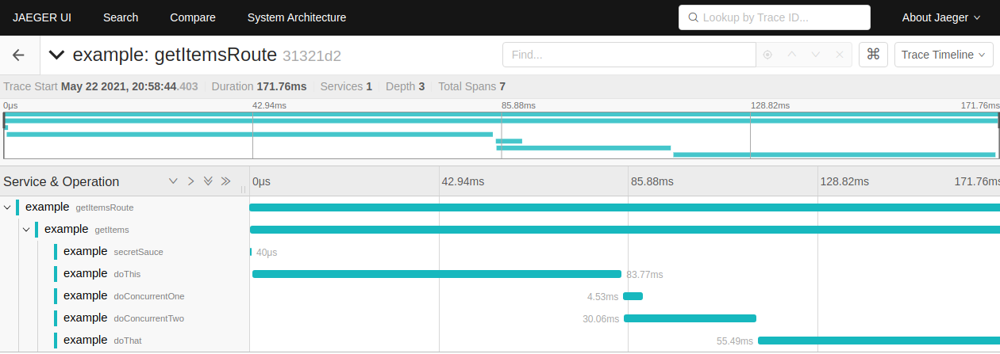
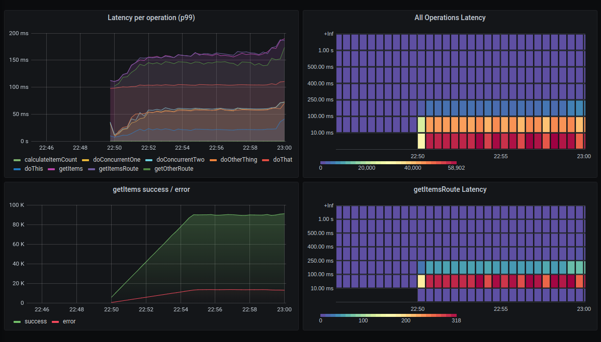

# instrument-this

Effortlessly add tracing and metrics to your Node services with an `@Instrument` decorator.

### Getting Started

Install `instrument-this` from NPM:

```
npm install --save instrument-this
```

### Initialize OpenTelemetry

Initialize OpenTelemetry tracing the usual way, get a `TracerProvider`:

```ts
// Initialize a TraceExporter...
const tracerProvider = new NodeTracerProvider();
// Initialize other instrumentations like HTTP, gRPC etc.
tracerProvider.addSpanProcessor(new SimpleSpanProcessor(exporter));
tracerProvider.register();
```

### Initialize a Metrics Provider

This library provides OpenTelemetry and Prometheus-based metrics providers.

```ts
const promMetricsProvider = new PromMetricsProvider();
```

You can also provide your own metrics provider by implementing the `MetricsProvider` interface.

### Initialize Instrument-this

After initializing OpenTelemetry and a MetricsProvider, the last step is to call `initializeInstrumentation` like this, and you're ready to go.

```ts
import { Instrument, initializeInstrumentation } from 'instrument-this';

initializeInstrumentation({
    processName: 'example',
    tracer: tracerProvider.getTracer('example'),
    metricsProvider: promMetricsProvider,
});

```

### Mark your methods with `@Instrument`

Simply add the `@Instrument()` decorator to your method. This creates a tracing span, as well as histogram and summary metrics to measure the execution of the method. If an exception is thrown inside the method, the span is marked with an error.

```ts
class MyService {

    @Instrument()
    async loadItems(count: number): Promise<Item> {
        // do things...
    }

}

```

There are a few options available in the instrument decorator.

You can give the spans and metrics a different name with the `name` property:

```ts
class MyService {
    @Instrument({ name: 'PreferredName' })
    async myPrivateMethod() {
        // ...
    }
}
```

You can disable metrics creation while keeping the span, or vice versa:

```ts
@Instrument({ metrics: { enabled: false } })
@Instrument({ tracing: { enabled: false } })
```

#### Export the Metrics

You can get the registry from the metrics provider and export them from a `/metrics` endpoint.

```ts
const router = new KoaRouter();
router.get('/metrics', async (ctx: Context) => {
    ctx.type = 'text';
    ctx.body = await provider.getRegistry().metrics();
});
```

### Example

An example project can be found in the `example` directory.

You can start up the whole stack with docker-compose:

```
docker-compose -f ./example/docker-compose.yml up --build
```

This will build the example server image and start it up along with Jaeger, Prometheus and Grafana.

Once it's up and running, you can make requests to http://localhost:8080/ and http://localhost:8080/other

The Jaeger UI should be available at localhost:16686, where you can explore the created spans:



Grafana should be available at http://localhost:3000 (username: admin, password: admin). Once you sign in, a dashboard called Example should be available to view.


